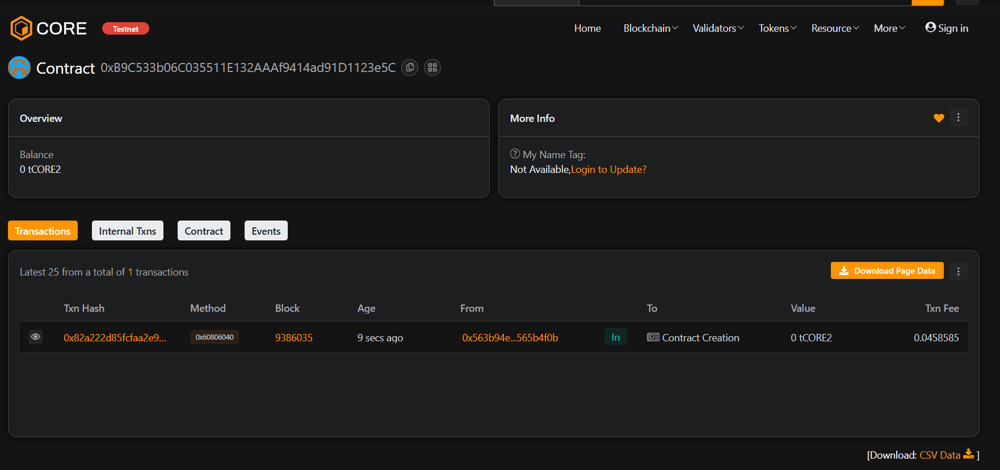

# 🔗 TrustCraft

## 📘 Project Description
**TrustCraft** is a decentralized trust management system built on Ethereum blockchain.  
It allows users to assign, track, and manage trust scores securely and transparently using smart contracts.

---

## 🌍 Project Vision
To build a transparent and tamper-proof trust evaluation ecosystem for decentralized platforms — enabling verifiable credibility across blockchain communities and applications.

---

## ✨ Key Features
- 🔐 **Owner-Based Access Control** — Only the contract owner can update trust scores.  
- 📊 **Transparent Trust Scores** — Publicly viewable trust metrics for any address.  
- 🔁 **Ownership Transfer** — Secure ownership handover mechanism.

---

## 🚀 Future Scope
- 🧠 Integrate AI-based trust analytics.
- 🌐 Launch a user dashboard for visualizing trust levels.
- 🪙 Issue “Trust Tokens” for on-chain reputation.
- 🔄 DAO-based voting for decentralized trust updates.

---

## 🧩 Tech Stack
- **Solidity** for Smart Contracts  
- **Hardhat** for Development & Testing  
- **JavaScript** for Scripts  
- **Ethereum / Sepolia Testnet** for Deployment  

---

**Developed by:** _Your Name_  
**Version:** 1.0.0  

Contract Add :0xB9C533b06C035511E132AAAf9414ad91D1123e5C

